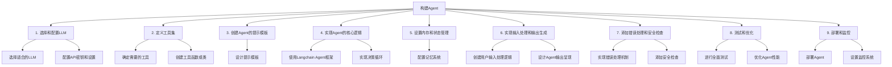

# 构建 agent

## what is agent?

LLM 不能产生动作，只能输出文本。Langchain 最大的用处之一就是构建 agent，让 LLM 能够执行动作。

Agent 是一个系统，其使用 LLM 作为其推理引擎，来决定采取什么样的动作以及向动作提供对应的参数；在执行完动作之后，将结果返回给 LLM 来决定是否采取下一步动作，或者直接结束。

以下是详细解释:

Agent 是一个智能系统，它结合了大语言模型（LLM）的推理能力和执行具体任务的工具。以下是 Agent 的主要特点：

1. 决策能力：使用 LLM 作为其核心决策引擎，分析情况并决定下一步行动。
2. 工具使用：能够调用和使用各种预定义的工具或 API 来执行具体任务。
3. 循环执行：在执行一个动作后，会将结果反馈给 LLM，然后决定是继续执行新的动作还是完成任务。
4. 灵活性：可以处理各种复杂任务，因为它能够根据情况选择合适的工具和策略。
5. 自主性：在给定的任务范围内，能够自主地规划和执行一系列步骤来达成目标。

通过这种方式，Agent 能够执行比单纯的 LLM 更复杂和实际的任务，如信息搜索、数据分析、问题解决等。

## how to build agent?

构建 Agent 的步骤如下：

示例代码（基于前文的 Langchain 和 Tavily 搜索工具）: [build_agent.py](https://github.com/ka1fe1/tutorial-langchain/tree/main/tutorial-app/4_build_agent.py)

