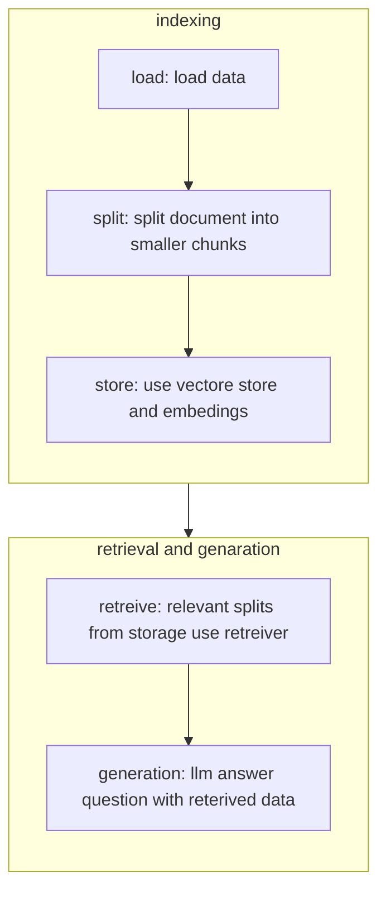

# RAG

## what is rag

RAG(Retrieval Augmented Generation) 是一种使用外部数据来增强大模型的技术。

## How to use RAG

```mermaid
flowchart TB
    subgraph s1["indexing"]
        direction TB
        load["load: load data"]
        split["split: split document into smaller chunks"]
        store["store: use vectore store and embedings"]
        load --> split --> store
    end
    subgraph s2["retrieval and genaration"]
        direction TB
        retreive["retreive: relevant splits from storage use retreiver"]
        generation["generation: llm answer question with reterived data"]
        retreive --> generation
    end

    s1 --> s2
```
