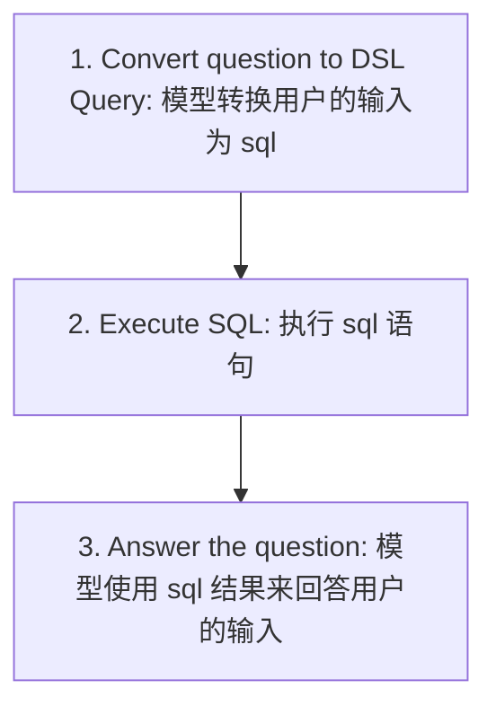
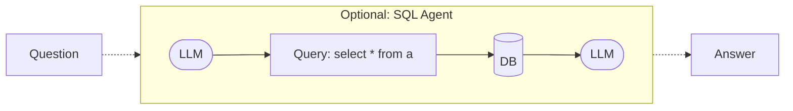

# Build rag over sql

## how to build rag with sql

实现有以下关键的 3 步:

那么问题的关键在于如何实现上面的 3 个步骤

### use llm

1. langchain 使用 `create_sql_query_chain` 来实现 query -> sql 的转换
2. langchain 使用 `QuerySQLDatabaseTool` 来实现 sql 执行
3. 将用户的问题和 sql 执行结果传给 llm 来生成对用户的响应

### use agent

1. 可以使用 `SQLDatabaseToolkit` 来实现 rag over sql 的功能