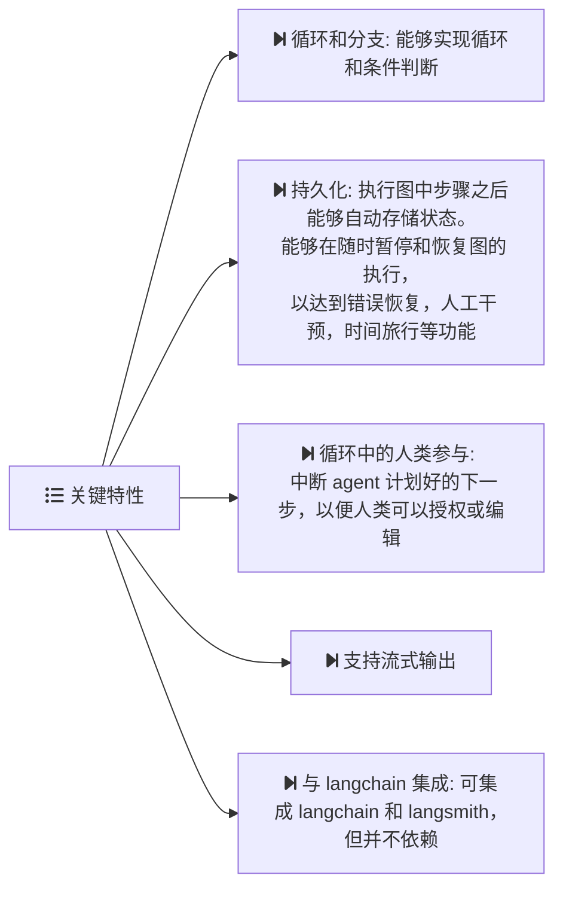
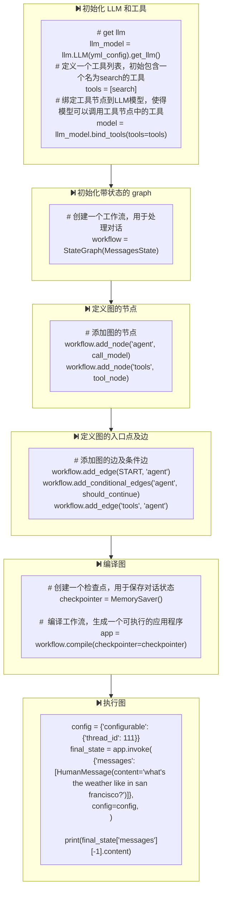

# langgraph overview

- [langgraph overview](#langgraph-overview)
  - [what is langgraph?](#what-is-langgraph)
    - [key features](#key-features)
  - [how to build langgraph](#how-to-build-langgraph)

## what is langgraph?

langgraph 是一个使用 LLM 来构建有状态，多角色应用的库，可用于创建 agent 以及多个 agent 协作的工作流；

### key features

## how to build langgraph

完整代码详见: [langgraph_example.py](https://github.com/ka1fe1/tutorial-langchain/tree/main/tutorial-app/langgraph/0-overview/example.py)

