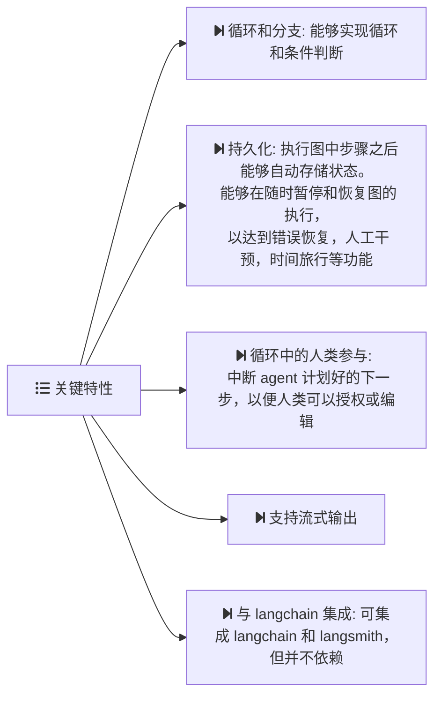

# langgraph overview

## what is langgraph?

langgraph 是一个使用 LLM 来构建有状态，多角色应用的库，可用于创建 agent 以及多个 agent 协作的工作流；

### key features

```mermaid
flowchart LR
    s0[fa:fa-list-ul 关键特性]
    s1["fa:fa-step-forward 循环和分支: 能够实现循环和条件判断"]
    s2["fa:fa-step-forward 持久化: 执行图中步骤之后能够自动存储状态。<br/> 能够在随时暂停和恢复图的执行，<br/> 以达到错误恢复，人工干预，时间旅行等功能"]
    s3["fa:fa-step-forward 循环中的人类参与: <br/> 中断 agent 计划好的下一步，以便人类可以授权或编辑"]
    s4["fa:fa-step-forward 支持流式输出"]
    s5["fa:fa-step-forward 与 langchain 集成: 可集成 langchain 和 langsmith，但并不依赖"]

    s0 --> s1
    s0 --> s2
    s0 --> s3
    s0 --> s4
    s0 --> s5
```