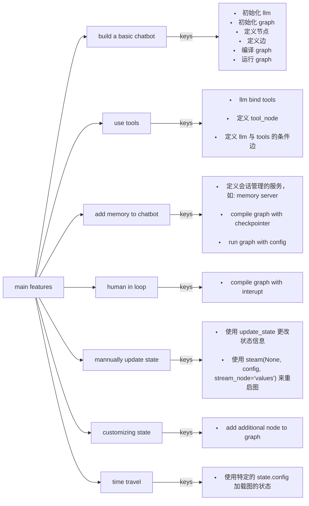

# langgraph quick start

```mermaid
flowchart LR
    s0["main features"]
    s1["build a basic chatbot"]
    s2["use tools"]
    s3["add memory to chatbot"]
    s4["human in loop"]
    s5["mannually update state"]
    s6["customizing state"]
    s7["time travel"]

    k1["
    <li> 初始化 llm
    <li> 初始化 graph
    <li> 定义节点
    <li> 定义边
    <li> 编译 graph
    <li> 运行 graph
    "]
    k2["
    <li> llm bind tools
    <li> 定义 tool_node
    <li> 定义 llm 与 tools 的条件边
    "]
    k3["
    <li> 定义会话管理的服务，如: memory server
    <li> compile graph with checkpointer
    <li> run graph with config
    "]
    k4["
    <li> compile graph with interupt
    "]
    k5["
    <li> 使用 update_state 更改状态信息
    <li> 使用 steam(None, config, stream_node='values') 来重启图
    "]
    k6["
    <li> add additional node to graph
    "]
    k7["
    <li> 使用特定的 state.config 加载图的状态
    "]

    s0 --> s1 -->|"keys"| k1
    s0 --> s2 -->|"keys"| k2
    s0 --> s3 -->|"keys"| k3
    s0 --> s4 -->|"keys"| k4
    s0 --> s5 -->|"keys"| k5
    s0 --> s6 -->|"keys"| k6
    s0 --> s7 -->|"keys"| k7
```

[langgraph quick start](https://github.com/langchain-ai/langgraph/blob/main/docs/tutorial-app/langgraph/1-quick-start/5-manually-update-state.py)