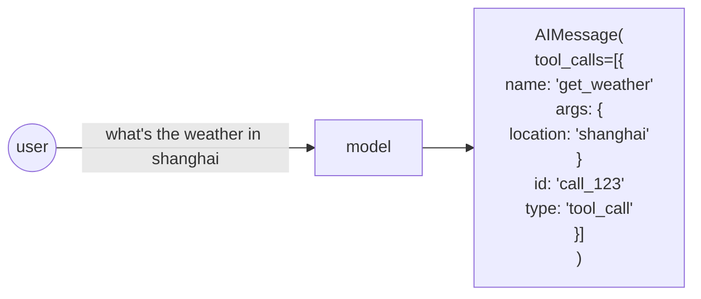
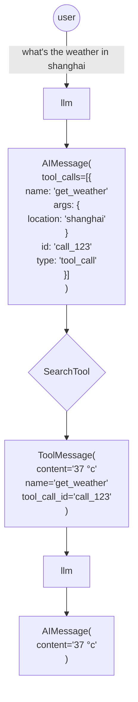

# tool guides
- [tool guides](#tool-guides)
  - [how to create tool](#how-to-create-tool)
    - [create tool from function](#create-tool-from-function)
      - [use `@tool` decorator](#use-tool-decorator)
      - [use StructuredTool](#use-structuredtool)
    - [create tool from runnables](#create-tool-from-runnables)
    - [subclass BaseTool](#subclass-basetool)
    - [create async tools](#create-async-tools)
  - [how to use build-in tool and toolkits](#how-to-use-build-in-tool-and-toolkits)
  - [how to use chat model to call tools](#how-to-use-chat-model-to-call-tools)
  - [how to pass tool output to chat model](#how-to-pass-tool-output-to-chat-model)
  - [how to pass run time values to tools](#how-to-pass-run-time-values-to-tools)
  - [how to add human-in-loop before invoke tools](#how-to-add-human-in-loop-before-invoke-tools)
  - [how to handle tool errors](#how-to-handle-tool-errors)
    - [Try/except tool call](#tryexcept-tool-call)
    - [fallbacks](#fallbacks)
  - [how to force models to call a tool](#how-to-force-models-to-call-a-tool)
  - [how to access RunnableConfig from a tool](#how-to-access-runnableconfig-from-a-tool)
  - [tool artifacts](#tool-artifacts)
    - [what is tool artifacts](#what-is-tool-artifacts)
    - [why need tool artifacts](#why-need-tool-artifacts)
    - [how to return tool artifacts from a tool](#how-to-return-tool-artifacts-from-a-tool)
  - [how to pass secrets to runnables](#how-to-pass-secrets-to-runnables)


> **Ref:** [https://python.langchain.com/docs/how_to/#tools](https://python.langchain.com/docs/how_to/#tools)

## how to create tool

### create tool from function

#### use `@tool` decorator

```python
from typing import Annotated, List


@tool
def multiply_by_max(
    a: Annotated[str, "scale factor"],
    b: Annotated[List[int], "list of ints over which to take maximum"],
) -> int:
    """Multiply a by the maximum of b."""
    return a * max(b)


multiply_by_max.args_schema.schema()
```

#### use StructuredTool

使用 `StructuredTool.from_function` 方法来实现

```python
from langchain_core.tools import StructuredTool
from pydantic import BaseModel, Field

class CalculatorInput(BaseModel):
    a: int = Field(description="first number")
    b: int = Field(description="second number")


def multiply(a: int, b: int) -> int:
    """Multiply two numbers."""
    return a * b


calculator = StructuredTool.from_function(
    func=multiply,
    name="Calculator",
    description="multiply numbers",
    args_schema=CalculatorInput,
    return_direct=True,
    # coroutine= ... <- you can specify an async method if desired as well
)
```

### create tool from runnables

- 详见: [https://python.langchain.com/docs/how_to/custom_tools/#creating-tools-from-runnables](https://python.langchain.com/docs/how_to/custom_tools/#creating-tools-from-runnables)

### subclass BaseTool

```python
from typing import Optional, Type

from langchain_core.callbacks import (
    AsyncCallbackManagerForToolRun,
    CallbackManagerForToolRun,
)
from langchain_core.tools import BaseTool
from pydantic import BaseModel


class CalculatorInput(BaseModel):
    a: int = Field(description="first number")
    b: int = Field(description="second number")


# Note: It's important that every field has type hints. BaseTool is a
# Pydantic class and not having type hints can lead to unexpected behavior.
class CustomCalculatorTool(BaseTool):
    name: str = "Calculator"
    description: str = "useful for when you need to answer questions about math"
    args_schema: Type[BaseModel] = CalculatorInput
    return_direct: bool = True

    def _run(
        self, a: int, b: int, run_manager: Optional[CallbackManagerForToolRun] = None
    ) -> str:
        """Use the tool."""
        return a * b

    async def _arun(
        self,
        a: int,
        b: int,
        run_manager: Optional[AsyncCallbackManagerForToolRun] = None,
    ) -> str:
        """Use the tool asynchronously."""
        # If the calculation is cheap, you can just delegate to the sync implementation
        # as shown below.
        # If the sync calculation is expensive, you should delete the entire _arun method.
        # LangChain will automatically provide a better implementation that will
        # kick off the task in a thread to make sure it doesn't block other async code.
        return self._run(a, b, run_manager=run_manager.get_sync())
```

```python
multiply = CustomCalculatorTool()
print(multiply.name)
print(multiply.description)
print(multiply.args)
print(multiply.return_direct)

print(multiply.invoke({"a": 2, "b": 3}))
print(await multiply.ainvoke({"a": 2, "b": 3}))
```

### create async tools

- LangChain's by default provides an async implementation that assumes that the function is expensive to compute, so it'll delegate execution to another thread.
- If you're working in an async codebase, you should create async tools rather than sync tools, to avoid incuring a small overhead due to that thread.
- If you need both sync and async implementations, use `StructuredTool.from_function` or sub-class from `BaseTool`.
- You CANNOT and SHOULD NOT use the sync `invoke` with an async tool

## how to use build-in tool and toolkits

langchain 内置了很多工具和工具集，详见: [https://python.langchain.com/docs/integrations/tools/](https://python.langchain.com/docs/integrations/tools/)

## how to use chat model to call tools

模型通过 `call a tool` 来实现根据提示词做出响应。但实际上模型并不直接的采取动作，它只是生成参数给到对应的工具(即工具调用信息的 AIMessage)，是否调用工具由用户决定。



实现要点:
1. 通过 `llm_with_tools = llm.bind_tools()` 来实现模型绑定工具
2. 通过 `llm_with_tools.invoke(messages).tool_calls` 的 `tool_calls` 属性，可以得到一个合法的工具调用信息

## how to pass tool output to chat model



实现要点:
1. 通过 `tool_calls` 得到工具调用信息，然后对用对应的工具，得到 `ToolMessage`
2. 将 `ToolMessage` 添加到 messages 中，然后再次调用模型，模型便可生成最后的答案

```python
query = "What is 3 * 12 and 3 + 12?"
messages = [HumanMessage(query)]
ai_msg = llm_with_tools.invoke(messages)

print(f"ai_msg:\n {ai_msg}")
print("-"*100)

messages.append(ai_msg)
for tool_call in ai_msg.tool_calls:
    tool = tools_dict[tool_call["name"].lower()]
    tool_msg = tool.invoke(tool_call)
    messages.append(tool_msg)

print(f"messages:\n {messages}")
print("-"*100)

# Re-invoke LLM with updated messages
updated_ai_msg = llm_with_tools.invoke(messages)

print(f"Updated ai_msg:\n {updated_ai_msg}")
print("-" * 100)
```

## how to pass run time values to tools

实现要点:
1. 使用 `InjectedToolArg` 注释来实现参数的隐藏，这意味着这些参数不会由模型生成
2. 在调用工具时，动态注入被隐藏的参数

```python
for tool_call in ai_msg.tool_calls:
    tool = tools_map[tool_call["name"].lower()]
    # 动态注入参数值
    tool_call["args"]["user_id"] = "123"
    tool_response = tool.invoke(tool_call["args"])
    messages.append(tool_response)
```

## how to add human-in-loop before invoke tools

实现要点:
1. 在生成工具调用信息之后，在正式调用工具之间，可以加入人工干预

```python
chain = llm_with_tools | human_approval | call_tools
chain.invoke()
```

```python
class NotApproved(Exception):
    """Custom exception."""

def human_approval(msg: AIMessage) -> AIMessage:
    """Responsible for passing through its input or raising an exception.

    Args:
        msg: output from the chat model

    Returns:
        msg: original output from the msg
    """
    tool_strs = "\n\n".join(
        json.dumps(tool_call, indent=2) for tool_call in msg.tool_calls
    )
    input_msg = (
        f"Do you approve of the following tool invocations\n\n{tool_strs}\n\n"
        "Anything except 'Y'/'Yes' (case-insensitive) will be treated as a no.\n >>>"
    )
    resp = input(input_msg)
    if resp.lower() not in ("yes", "y"):
        raise NotApproved(f"Tool invocations not approved:\n\n{tool_strs}")
    return msg
```

## how to handle tool errors

### Try/except tool call

在 tool_call 时使用 `try/except` 来捕获错误。

```python
def try_except_tool(tool_args: dict, config: RunnableConfig) -> Runnable:
    try
        complex_tool.invoke(tool_args, config=config)
    except Exception as e:
        return f"calling tool with args: \n\n{tool_args}\n\n raised the following err:\n\n {type(e)}: {e}"

chain = llm_with_tools | (lambda msg: msg.tool_calls[0]["args"]) | try_except_tool 

print (
    chain.invoke("""
    use complex tool, the args are 5, 2.1, empty dictionary，don't forget dict_arg
    """)
)
```

### fallbacks

使用 `chain.with_fallbacks()` 函数来实现添加回退机制

```python
def exception_to_messages(input: dict) -> dict: 
    exception = input.pop("exception")

    messages = [
        AIMessage(content="", tool_calls=[exception.tool_call]),
        ToolMessage(
            tool_call_id=exception.tool_call["id"], content=str(exception.exception)
        ),
        HumanMessage(
            content="""
            The last tool call raised an exception. 
            Try calling the tool again with corrected arguments. Do not repeat mistakes.
            """
        )
    ]

    inputs["last_output"] = messages
    return inputs

prompt = ChatPromptTmplate.from_messages(
    [("human", "{input}"), ("placeholder", "{last_output}")]
)

chain = prompt | llm_with_tools | tool_custom_exception

self_correcting_chain = chain.with_fallbacks(
    [exception_to_messages | chain], exception_key = "exception"
)

self_correcting_chain.invoke(
    {
        "input": """
        The last tool call raised an exception. 
        Try calling the tool again with corrected arguments. Do not repeat mistakes.
        """
    }
)
```

## how to force models to call a tool

在绑定 tools 时，使用 `tool_choice` 参数，该参数有如下用法:
- 填入具体的 tool name: 强制使用该 tool
- 填入 `any`: 从 tools 中最少选择一个来使用

```python
llm_forced_to_multipy = llm.bind_tools(tools, tool_choice="Multiply")
llm_forced_to_multipy.invoke("what is 2+4")
```

```python
llm_forced_to_multipy = llm.bind_tools(tools, tool_choice="any")
llm_forced_to_multipy.invoke("what is 2+4")
```

## how to access RunnableConfig from a tool


给工具定义一个 type 为 `RunnableConfig` 的参数，然后就可以从配置中读取参数了

```python
@tool
async def reverse_tool(text: str, special_config_param: RunnableConfig) -> str:
    return (text + special_config_param["configuable"]["additional_field"])

await reverse_tool.ainvoke(
    {"text": abc},
    config={"configuable": {"additional_field": 123}}
)
```

## tool artifacts

### what is tool artifacts

在 langchain 中，tool 的 artifacts 值得是工具在执行过程中产生的额外的，辅助性的输出结果或数据对象。
这些 artifacts 通常不作为工具对模型的主要响应内容(通常由工具消息的 `content` 部分提供)，但它们可以为后续的处理、分析、调试或者其他目的提供有价值的信息

### why need tool artifacts

**一. 存储中间结果和额外数据**

1. 方便后续处理: 工件存储中间结果，方便后续工具直接使用
2. 提供更多信息: 利用存储额外数据，方便调试、测试及监控

**二. 支持负责业务流程和多工具协作**

1. 传递状态信息: 利用 artifacts 来实现多工具协调工作
2. 实现数据传递和共享

**三. 便于调试和监控**

1. 记录执行过程
2. 提供审计线索

### how to return tool artifacts from a tool

在定义工具时:
1. 指定 `response_format="content_and_artifacts"` 
2. 返回值是一个 tuple of (contet, artifacts)

```python
def generate_random_ints(min: int, max: int, size: int) -> Tuple(str, List[int]):
    """Generate size random ints in the range [min, max]."""
    array = [random.randint(min, max) for _ in range(size)]
    content = f"Successfully generated array of {size} random ints in [{min}, {max}]."
    return content, array
```

## how to pass secrets to runnables

实现要点:
1. 定义一个 `RunnableConfig.configurable` 对象的属性，其 key 的前缀为 `__`，即可实现这些敏感字段，在调用过程中不被追踪

```python
from langchain_core.runnables import RunnableConfig
from langchain_core.tools import tool


@tool
def foo(x: int, config: RunnableConfig) -> int:
    """Sum x and a secret int"""
    return x + config["configurable"]["__top_secret_int"]


foo.invoke({"x": 5}, {"configurable": {"__top_secret_int": 2, "traced_key": "bar"}})
``` 


